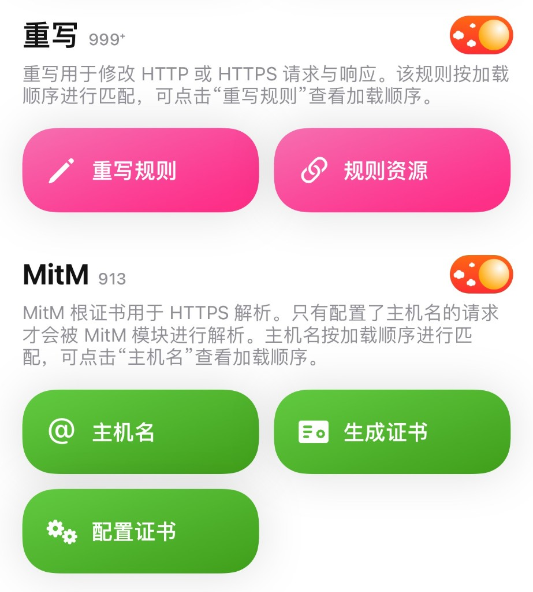
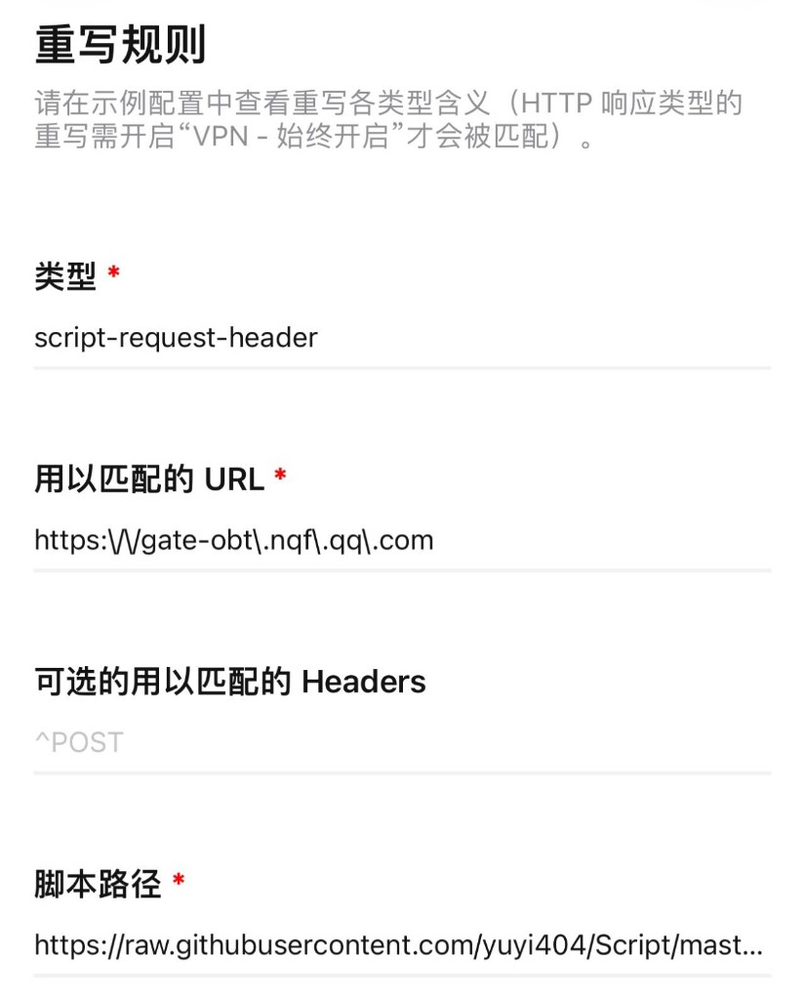

# lover528/Script

拦截 `gate-obt.nqf.qq.com` 请求并提取 `code`（Quantumult X / Loon）。

## Quantumult X

配置入口示意（重写 + MitM）：



### 方式一：规则资源（推荐）

1. 打开 **重写** → 打开开关  
2. 点 **规则资源** → 添加：

```text
https://raw.githubusercontent.com/lover528/Script/master/farm-code.qxrewrite.conf
```

3. 确认 **MitM** 已开启，证书已信任

资源内容已包含：

- 重写：`script-request-header` → `farm-code.js`
- 主机名：`gate-obt.nqf.qq.com`

### 方式二：手动添加

点 **重写规则** → 右上角 `+`，按下面填写：



| 项 | 值 |
| --- | --- |
| 类型 | `script-request-header` |
| 用以匹配的 URL | `https:\/\/gate-obt\.nqf\.qq\.com` |
| 可选的用以匹配的 Headers | `^POST`（可选） |
| 脚本路径 | `https://raw.githubusercontent.com/lover528/Script/master/farm-code.js` |

再打开 **MitM** → **主机名**，添加：

```text
gate-obt.nqf.qq.com
```

## Loon

订阅插件：

```text
https://raw.githubusercontent.com/lover528/Script/master/farm-code.loon.plugin
```
